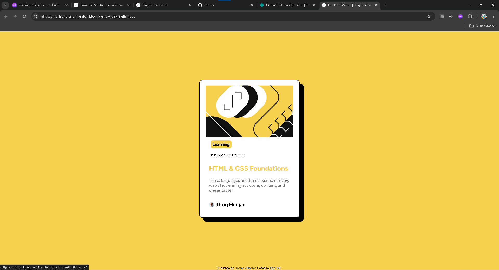

# Frontend Mentor - Blog preview card solution

This is a solution to the [Blog preview card challenge on Frontend Mentor](https://www.frontendmentor.io/challenges/blog-preview-card-ckPaj01IcS). Frontend Mentor challenges help you improve your coding skills by building realistic projects.

## Table of contents

- [Screenshot](#screenshot)
- [Links](#links)
- [Built with](#built-with)
- [What I learned](#what-i-learned)
- [Author](#author)

### Screenshot

### Links

- Solution URL: [Add solution URL here](https://your-solution-url.com)
- Live Site URL: [https://mysfront-end-mentor-blog-preview-card.netlify.app/](https://mysfront-end-mentor-blog-preview-card.netlify.app/)

### Built with

- Basic HTML
- Basic CSS

### What I learned

There was nothing specific that I've learn during this project but everything I've learn so far was used(including new things that I've learn recently)

## Author

- Website - [Miarinaly](https://mysfront-end-mentor-blog-preview-card.netlify.app/)
- Frontend Mentor - [@Mys1337](https://www.frontendmentor.io/profile/Mys1337)
